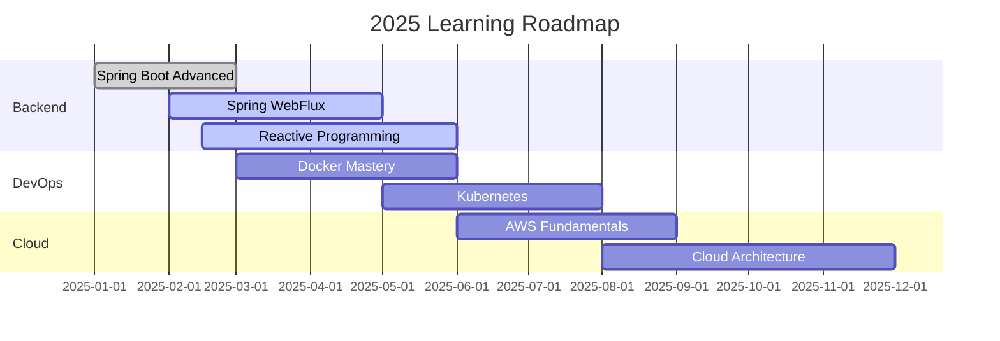

<!-- Animated Header -->
<div align="center">
  
</div>

<!-- Typing Animation -->
<h1 align="center">
  
  
  
</h1>

<!-- Profile Views & Stats -->
<div align="center">
  
  
  
  
</div>

<br>

<!-- Snake Animation -->
<div align="center">
  
</div>

<!-- Divider -->


## 🚀 About Me


```javascript
const shreyas = {
    name: "Shreyas Shinde",
    location: "Maharashtra, India 🇮🇳",
    role: "Backend Java Developer",
    company: "HCL Tech",
    
    languages: ["Java", "JavaScript", "SQL", "HTML/CSS"],
    frameworks: ["Spring Boot", "Spring Security", "Spring Cloud"],
    databases: ["MySQL", "PostgreSQL", "Redis"],
    tools: ["Docker", "Git", "Maven", "Postman", "IntelliJ IDEA"],
    
    exploring: ["Spring WebFlux", "Reactive/Async Programming", "RxJava", "Kubernetes", "AWS"],
    
    goals: [
        "Master Reactive Programming",
        "Contribute to Open Source",
        "Learn Cloud Technologies", 
        "Build Production-Ready Apps"
    ],
    
    motto: "Code with passion, debug with patience ☕"
};
```

### 🌟 Quick Facts
- 🔭 Currently working on **Advanced Spring Boot Microservices**
- 🌱 Learning **Spring WebFlux, Reactive Programming & RxJava**
- 👯 Looking to collaborate on **Java/Spring Boot Projects**
- 🤔 Ask me about **Java, Spring Framework, System Design**
- 📫 Reach me at **mr.shreyasshinde@gmail.com**
- ⚡ Fun fact: **I can debug code faster with coffee** ☕

---

## 🛠️ Technical Arsenal

<div align="center">

### Programming Languages


### Frameworks & Libraries


### Databases & Storage


### DevOps & Tools


### Operating Systems


</div>

---

## 🎯 Featured Project

<div align="center">

### 🎬 BookMyShow - Ticket Booking Platform

[](https://github.com/Shreyas3-git/bookmyshow)


</div>

**🏗️ Architecture:** Microservices-based architecture with Spring Boot  
**🔐 Security:** JWT Authentication with Spring Security  
**💾 Database:** MySQL with JPA/Hibernate ORM  
**🧪 Testing:** Comprehensive testing with JUnit 5 & Mockito

#### ✨ Key Features Implemented:
```yaml
🎫 Booking Management:
  ├── Real-time seat selection
  ├── Payment gateway integration  
  ├── Booking confirmation via email
  └── Cancellation & refund handling

🔐 User Authentication:
  ├── JWT-based authentication
  ├── Role-based access control (User/Admin)
  ├── Password encryption with BCrypt
  └── Session management

🏛️ System Architecture:
  ├── RESTful API design
  ├── Service layer architecture
  ├── Data validation & error handling
  └── Logging & monitoring
```

---

## 📊 GitHub Statistics

<!-- Alternative GitHub Stats -->
<div align="center">
  
<!-- GitHub Stats Card -->


<!-- Most Used Languages -->


</div>

<!-- GitHub Streak Stats -->
<div align="center">
  
</div>

<!-- Contribution Activity Graph -->
<div align="center">
  
</div>

---

## 🏆 GitHub Achievements

<div align="center">
  
</div>

---

## 📈 Coding Activity & Stats

<div align="center">

### 💻 This Week I Spent Time On:

```text
Java                    ████████████████████████▓   68.5% 
Spring Framework        ██████████▓░░░░░░░░░░░░░░   20.6%
Reactive Programming    ████▓░░░░░░░░░░░░░░░░░░░░    6.8%
Database Design         ██▓░░░░░░░░░░░░░░░░░░░░░░    4.1%
```

### 🔥 Current Learning Streak:
- 🎯 **150+ Days** of consistent coding
- 📚 **5+ Technologies** actively learning
- 🚀 **3+ Projects** in development
- 💡 **Daily** algorithm practice

</div>

---

## 🎯 2025 Goals & Roadmap

<div align="center">

### 🚀 Technical Goals
- [ ] 🌟 **Open Source**: Contribute to 10+ repositories
- [ ] ☁️ **Cloud**: Master AWS/Azure services  
- [ ] 🐳 **DevOps**: Docker & Kubernetes proficiency
- [ ] ⚡ **Reactive**: Master Spring WebFlux & RxJava
- [ ] 📝 **Content**: Write technical blog posts
- [x] ✅ **Security**: Advanced Spring Security implementation

### 📊 Learning Progress



</div>

---

## 🌐 Connect & Collaborate

<div align="center">

### 📬 Let's Connect!

[](mailto:mr.shreyasshinde@gmail.com)
[](https://www.linkedin.com/in/shreyas-shinde-384328265/)
[](https://github.com/Shreyas3-git)
[](https://leetcode.com/Shreyas3-git)

### 🤝 Open for Collaboration

```yaml
Looking for:
  - Java/Spring Boot projects
  - Reactive programming projects
  - Open source contributions
  - Mentorship opportunities
  - Technical discussions

Best way to reach me:
  📧 Email: mr.shreyasshinde@gmail.com
  💼 LinkedIn: shreyas-shinde-384328265
  
Response time: Usually within 24 hours ⚡
```

</div>

---

## 💡 Developer Insights

<details>
<summary><b>🎭 My Developer Journey in GIFs</b></summary>
<br>

<div align="center">

**When my code compiles on the first try:**
<br>


**Debugging at 3 AM:**
<br>


**When someone asks me to add "just one more feature":**
<br>


</div>

</details>

<details>
<summary><b>📊 Detailed Tech Stack Breakdown</b></summary>
<br>

```yaml
Backend Development:
  Languages: [Java 17+, JavaScript ES6+]
  Frameworks: [Spring Boot 3.x, Spring Security 6.x, Spring WebFlux]
  Reactive: [RxJava, Reactor, WebFlux]
  Architecture: [Microservices, RESTful APIs, Reactive APIs]
  Testing: [JUnit 5, Mockito, Integration Testing]

Database & Storage:
  Relational: [MySQL 8.x, PostgreSQL]
  In-Memory: [Redis, H2 Database]
  ORM: [JPA/Hibernate, Spring Data JPA, Spring Data R2DBC]

Development Tools:
  IDE: [IntelliJ IDEA Ultimate]
  Build Tools: [Maven, Gradle]
  Version Control: [Git, GitHub]
  API Testing: [Postman, Swagger]

DevOps & Deployment:
  Containerization: [Docker]
  Learning: [Kubernetes, Jenkins]
  Cloud Platforms: [Learning AWS]
```

</details>

---

## 🎨 Latest Learning Resources

<div align="center">

### 📚 Currently Reading/Watching:
- 📖 **"Reactive Programming with Spring WebFlux"** by Baeldung
- 🎥 **Spring WebFlux & Reactive Programming** - Udemy
- 📚 **"RxJava Essentials"** by Ivan Morgillo  
- 🎯 **System Design Interview** preparations

### 🏅 Recent Achievements:
- ✅ Completed **Spring Boot Advanced Course**
- 🎯 Solved **100+ LeetCode Problems** 
- 🚀 Built **Production-Ready Microservice**
- 📝 Implemented **JWT Authentication System**
- ⚡ Started **Reactive Programming Journey**

</div>

---

## 🎯 Fun Facts & Quotes

<div align="center">

### 💭 My Coding Philosophy

> *"First, solve the problem. Then, write the code."* - John Johnson

### ☕ Developer Fuel Stats:
```
Coffee consumed: ████████████████████████████████████████ 99%
Bugs fixed:      ███████████████████████████████████████▓ 95%
Code quality:    ██████████████████████████████████████▓░ 92%
Sleep quality:   ████████▓░░░░░░░░░░░░░░░░░░░░░░░░░░░░░░░░ 25%
```

### 🎲 Random Dev Fact:
*Did you know? Reactive Programming can handle 10,000+ concurrent requests while traditional blocking code struggles with just 1,000!* ⚡

</div>

---

<!-- Footer -->
<div align="center">
  
### 🌟 Thanks for visiting! Let's build something amazing together! 🚀


**⭐ Star my repositories if you find them useful!**

</div>

<!-- Animated Footer -->
<div align="center">
  
</div>

<!-- Profile Views Counter -->
<div align="center">
  <b>Made with ❤️ by <a href="https://github.com/Shreyas3-git">Shreyas3-git</a></b>
  <br><br>
  
</div>
